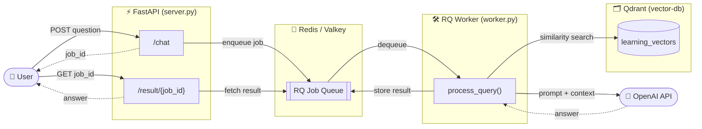
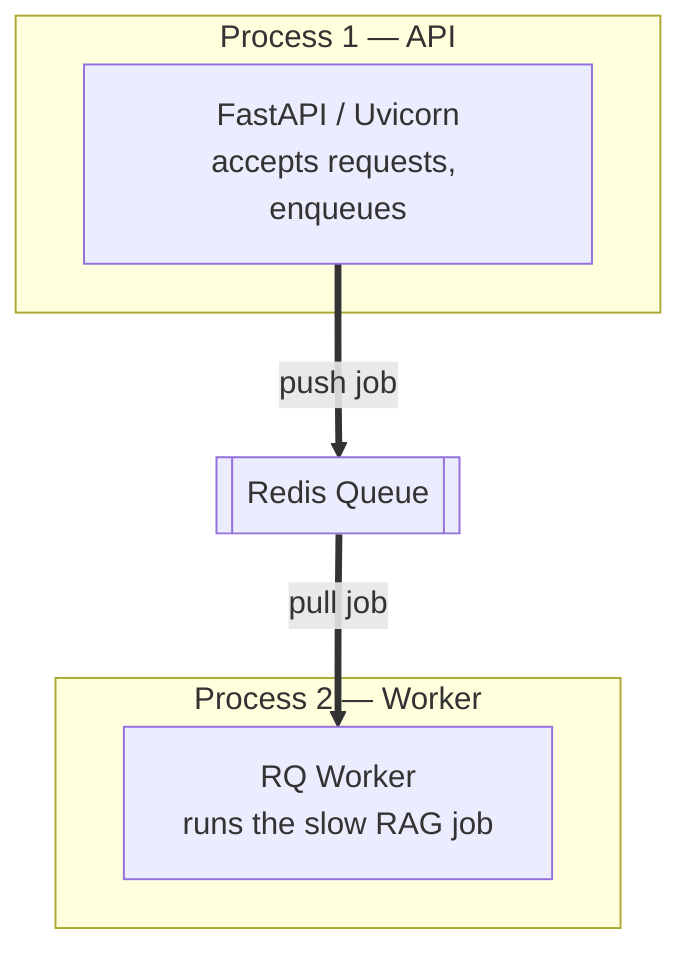
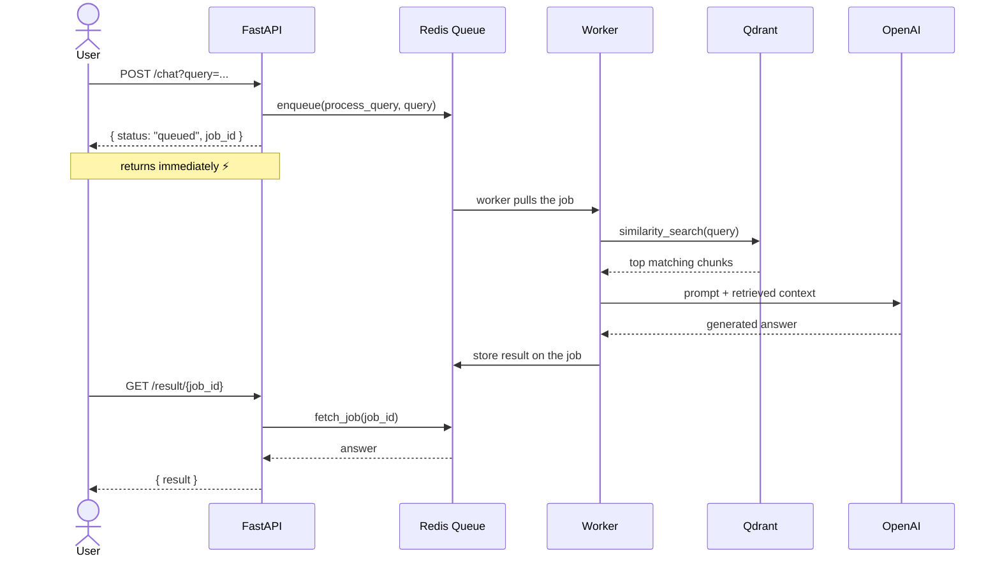
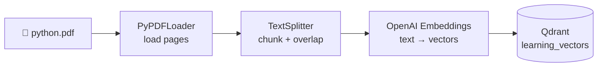

# 🧠 RAG Async Queue Pipeline

> Ask questions about a PDF and get AI answers — with the heavy work pushed onto a **background job queue** so the API stays fast.

A learning project built on **FastAPI · Redis (Valkey) · RQ · Qdrant · LangChain · OpenAI**, all wired together with an async producer/worker pattern.

---

## ✨ What it does

You upload/ingest a PDF once, then ask questions about it. Instead of making the
API do the slow embedding + LLM work while you wait, the API simply **drops a job
on a queue** and returns instantly. A separate **worker** picks the job up, runs
the retrieval-augmented generation, and stores the answer for you to fetch.

---

## 🏗️ Architecture



### Two independent processes, one shared queue

The whole design rests on splitting work across **two programs that never call
each other directly** — they only meet at the Redis queue:



This is what makes the API feel instant and lets you **scale by running more
workers** without touching the API.

---

## 🔄 Request lifecycle (the async flow)



---

## 📥 Ingestion (run once, offline)

Before any question can be answered, the PDF has to become searchable vectors.
That's the **ingestion** step — separate from the live query path.



> ⚠️ The query side uses `from_existing_collection`, which only **reads**. You
> must run `ingestion.py` first to **create and fill** the `learning_vectors`
> collection — otherwise queries fail with *"collection doesn't exist"*.

---

## 🧩 Components

| Component | File | Role |
|-----------|------|------|
| **API** | `server.py` / `main.py` | FastAPI endpoints `/chat` and `/result/{job_id}` |
| **Queue connection** | `queue/connection.py` | Redis connection + the RQ `Queue` object |
| **Worker logic** | `app/worker.py` | `process_query()` — retrieve + generate |
| **Ingestion** | `app/ingestion.py` | PDF → chunks → embeddings → Qdrant |
| **Vector DB** | Qdrant (Docker) | stores & searches the embedded chunks |
| **Broker** | Redis / Valkey (Docker) | holds queued jobs and their results |

---

## 🧪 Tech stack

| Layer | Tech |
|-------|------|
| Web API | FastAPI + Uvicorn |
| Job queue | RQ (Redis Queue) on Redis / Valkey |
| Vector database | Qdrant |
| RAG framework | LangChain |
| Embeddings + LLM | OpenAI |
| Infra | Docker Compose |

---

## 🚀 Run it (local)

> Python runs in a local venv; Redis & Qdrant run in Docker. Because the Python
> is on the host, it connects to the containers via **`localhost`** — not the
> Docker service names.

```powershell
# 1. Infra
docker compose up -d                                   # Redis :6379, Qdrant :6333

# 2. One-time: embed the PDF into Qdrant
python -m rag_async_distr_queue.app.ingestion

# 3. API  (terminal A)
python -m rag_async_distr_queue.main                   # http://localhost:8000/docs

# 4. Worker  (terminal B — SimpleWorker required on Windows)
rq worker --url redis://localhost:6379 --worker-class rq.SimpleWorker
```

Then in http://localhost:8000/docs: call **`/chat`**, copy the `job_id`, and read
the answer from **`/result/{job_id}`**.

---

## 💡 Why a queue?

| Without a queue | With a queue |
|-----------------|--------------|
| API blocks while embedding + LLM run | API returns instantly with a `job_id` |
| One slow request ties up the server | Work absorbed by background workers |
| Hard to scale | Add more workers to go faster |
| A crash loses the in-flight request | Jobs persist in Redis, survive restarts |
